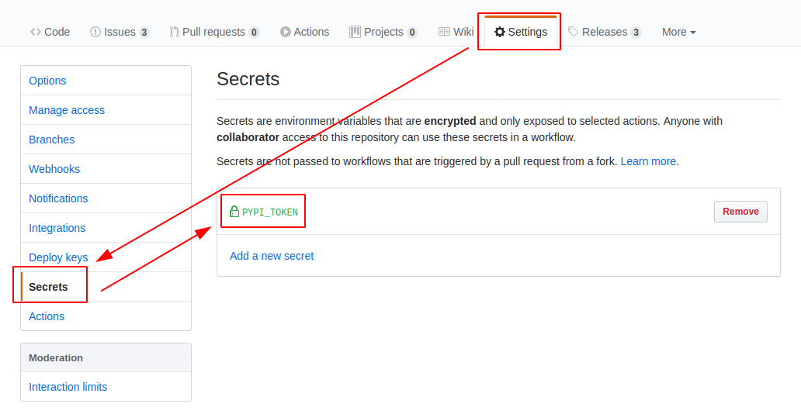

# responsive-images-generator

<p align="center">
    <em>A summary phrase to catch attention!</em>
</p>

<p align="center">
<a href="https://github.com/mccarthysean/responsive-images-generator/actions?query=workflow%3ATest" target="_blank">
    
</a>
<a href="https://github.com/mccarthysean/responsive-images-generator/actions?query=workflow%3APublish" target="_blank">
    
</a>
<a href="https://codecov.io/gh/mccarthysean/responsive-images-generator" target="_blank">
    
</a>
<a href="https://pypi.org/project/responsive-images-generator" target="_blank">
    
</a>
<a href="https://pypi.org/project/responsive-images-generator/" target="_blank">
    
</a>

## Installing responsive-images-generator

Install the latest release:

```bash
pip install responsive-images-generator
```

Or you can clone `responsive-images-generator` and start locally

```bash

# ensure you have Poetry installed
pip install --user poetry

# install all dependencies (including dev)
poetry install

# develop!

```

## Example Usage

```python
import responsive-images-generator

# do stuff
```

Only **Python 3.6+** is supported as required by the black, pydantic packages

## Publishing to Pypi

### Poetry's documentation

Note that it is recommended to use [API tokens](https://pypi.org/help/#apitoken) when uploading packages to PyPI.

>Once you have created a new token, you can tell Poetry to use it:

<https://python-poetry.org/docs/repositories/#configuring-credentials>

We do this using GitHub Actions' Workflows and Repository Secrets!

### Repo Secrets

Go to your repo settings and add a `PYPI_TOKEN` environment variable:



### Inspect the GitHub Actions Publish Workflows

```yml
name: Publish

on:
  release:
    types:
      - created

jobs:
  publish:
    runs-on: ubuntu-latest
    steps:
      - uses: actions/checkout@v2
      ...
      ...
      ...
      - name: Publish
        env:
          PYPI_TOKEN: ${{ secrets.PYPI_TOKEN }}
        run: |
          poetry config pypi-token.pypi $PYPI_TOKEN
          bash scripts/publish.sh
```

> That's it!

When you make a release on GitHub, the publish workflow will run and deploy to PyPi! 🚀🎉😎

## Contributing Guide

Welcome! 😊👋

> Please see the [Contributing Guide](CONTRIBUTING.md).
